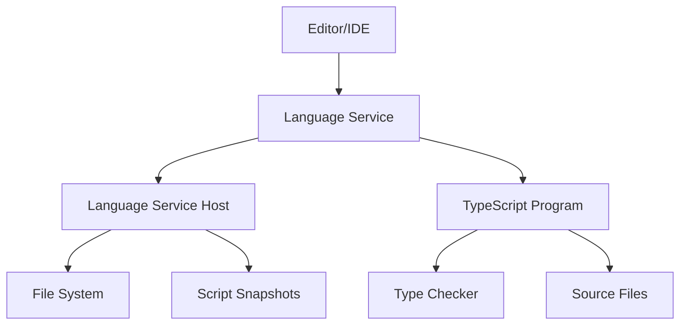

The TypeScript Language Service is the core API that powers editor integrations, providing features like completions, diagnostics, navigation, and refactoring. It's the bridge between TypeScript's compiler and editor tooling.

## What is the Language Service?

The Language Service is a high-level API that wraps TypeScript's compiler (`tsc`) to provide interactive editing features. While the compiler focuses on transforming TypeScript to JavaScript, the Language Service provides:

- **Code intelligence**: Completions, quick info, signature help
- **Diagnostics**: Syntax and semantic error reporting
- **Navigation**: Go to definition, find references, rename
- **Refactoring**: Extract method, organize imports, code fixes
- **Formatting**: Code formatting and indentation

## Architecture



### Core Components

<CardGroup cols={2}>
  <Card title="Language Service" icon="code">
    Main API providing editor features
  </Card>
  <Card title="Language Service Host" icon="server">
    Interface between editor and Language Service
  </Card>
  <Card title="Program" icon="folder-tree">
    Manages source files and compilation
  </Card>
  <Card title="Type Checker" icon="check">
    Performs type analysis and inference
  </Card>
</CardGroup>

## How tsserver Uses the Language Service

The TypeScript server (`tsserver`) is the primary consumer of the Language Service:

```typescript
import * as ts from 'typescript';

// Create a language service host
const host: ts.LanguageServiceHost = {
  getScriptFileNames: () => ['app.ts', 'utils.ts'],
  getScriptVersion: (fileName) => fileVersions.get(fileName),
  getScriptSnapshot: (fileName) => {
    if (!fs.existsSync(fileName)) return undefined;
    return ts.ScriptSnapshot.fromString(
      fs.readFileSync(fileName).toString()
    );
  },
  getCurrentDirectory: () => process.cwd(),
  getCompilationSettings: () => ({
    target: ts.ScriptTarget.ES2020,
    module: ts.ModuleKind.ESNext
  }),
  getDefaultLibFileName: (options) => 
    ts.getDefaultLibFilePath(options),
  fileExists: ts.sys.fileExists,
  readFile: ts.sys.readFile,
  readDirectory: ts.sys.readDirectory
};

// Create the language service
const service = ts.createLanguageService(host);

// Use it for completions
const completions = service.getCompletionsAtPosition(
  'app.ts',
  position,
  {}
);
```

### Request Flow

1. **Editor sends request** (e.g., "get completions at position 42")
2. **tsserver** receives the request via JSON protocol
3. **Language Service Host** provides file contents via snapshots
4. **Language Service** uses the Program and Type Checker
5. **Results** are returned to the editor

## Language Service Modes

The Language Service supports three modes via `LanguageServiceMode`:

<AccordionGroup>
  <Accordion title="Semantic (Full)" icon="brain">
    Complete type checking and semantic analysis. This is the default mode that provides all features including type-aware completions, semantic diagnostics, and refactorings.
    
    ```typescript
    ts.createLanguageService(
      host,
      registry,
      ts.LanguageServiceMode.Semantic
    );
    ```
  </Accordion>

  <Accordion title="PartialSemantic" icon="brain-circuit">
    Limited semantic analysis for better performance. Useful for large projects where full type checking may be too slow.
    
    ```typescript
    ts.createLanguageService(
      host,
      registry,
      ts.LanguageServiceMode.PartialSemantic
    );
    ```
  </Accordion>

  <Accordion title="Syntactic (Syntax Only)" icon="brackets-curly">
    Only syntax-based features, no type checking. Provides syntax highlighting, basic completions, and formatting without the overhead of type analysis.
    
    ```typescript
    ts.createLanguageService(
      host,
      registry,
      ts.LanguageServiceMode.Syntactic
    );
    ```
  </Accordion>
</AccordionGroup>

## Document Registry

The `DocumentRegistry` caches parsed source files across multiple Language Service instances:

```typescript
const registry = ts.createDocumentRegistry(
  useCaseSensitiveFileNames,
  currentDirectory
);

const service1 = ts.createLanguageService(host1, registry);
const service2 = ts.createLanguageService(host2, registry);
// Both services share cached source files
```

### Benefits

- **Memory efficiency**: Multiple projects share parsed ASTs
- **Performance**: Avoid re-parsing unchanged files
- **Incremental updates**: Reuse parts of the syntax tree

## Script Snapshots

Script snapshots provide an immutable view of file contents:

```typescript
interface IScriptSnapshot {
  getText(start: number, end: number): string;
  getLength(): number;
  getChangeRange(oldSnapshot: IScriptSnapshot): 
    TextChangeRange | undefined;
  dispose?(): void;
}

// Create from string
const snapshot = ts.ScriptSnapshot.fromString(fileContent);

// Use in host
getScriptSnapshot(fileName: string): IScriptSnapshot {
  const content = fs.readFileSync(fileName, 'utf8');
  return ts.ScriptSnapshot.fromString(content);
}
```

Snapshots enable:

- **Incremental parsing**: Detect which parts of a file changed
- **Consistency**: Immutable view during operation
- **Efficiency**: Avoid re-reading files multiple times

## Performance Considerations

<Warning>
  The first semantic operation (like `getSemanticDiagnostics`) can be expensive as it initializes the type system. Subsequent calls are much faster.
</Warning>

### Optimization Strategies

1. **Reuse Language Service instances**: Don't recreate for every operation
2. **Use syntax-only mode** when type information isn't needed
3. **Implement efficient snapshots**: Use incremental change detection
4. **Cache unchanged files**: Return same version string for unchanged files
5. **Leverage Document Registry**: Share parsed files across projects

## Version String

The version string returned by `getScriptVersion` is crucial:

```typescript
getScriptVersion(fileName: string): string {
  // Return different string when file changes
  return fileVersions.get(fileName) || '0';
}
```

<Info>
  The Language Service uses version strings to determine if a file has changed. Return the **same** string for unchanged files to enable caching.
</Info>

## Common Use Cases

### Editor Integration

```typescript
// Completions on typing
editor.on('change', async (position) => {
  const completions = service.getCompletionsAtPosition(
    fileName,
    position,
    { includeCompletionsForModuleExports: true }
  );
  showCompletionList(completions);
});

// Diagnostics on save
editor.on('save', async (fileName) => {
  const syntactic = service.getSyntacticDiagnostics(fileName);
  const semantic = service.getSemanticDiagnostics(fileName);
  showErrors([...syntactic, ...semantic]);
});
```

### Build Tools

```typescript
// Check all files in project
for (const fileName of project.getSourceFiles()) {
  const diagnostics = [
    ...service.getSyntacticDiagnostics(fileName),
    ...service.getSemanticDiagnostics(fileName)
  ];
  
  if (diagnostics.length > 0) {
    reportErrors(fileName, diagnostics);
  }
}
```

## Services Version

The Language Service API version is tracked separately from the TypeScript compiler version:

```typescript
import { servicesVersion } from 'typescript';

console.log(servicesVersion); // "0.8"
```

<Note>
  The services API is generally stable, but check compatibility when using advanced features.
</Note>

## Next Steps

<CardGroup cols={2}>
  <Card title="Language Service API" icon="code" href="./language-service">
    Detailed API reference with all methods
  </Card>
  <Card title="Completions" icon="sparkles" href="./completions">
    Learn about completion providers
  </Card>
  <Card title="Diagnostics" icon="triangle-exclamation" href="./diagnostics">
    Error and warning diagnostics
  </Card>
  <Card title="Navigation" icon="compass" href="./navigation">
    Go to definition, find references
  </Card>
</CardGroup>
