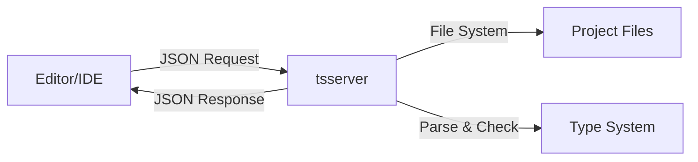

The `tsserver` command starts the TypeScript language server, which provides editor services like auto-completion, type checking, and refactoring.

<Note>
  `tsserver` is typically used by editors and IDEs, not directly by developers. This documentation is for tool authors and advanced users.
</Note>

## Installation

```bash
npm install -g typescript
```

## Basic Usage

```bash
tsserver
```

The server communicates via stdin/stdout using JSON messages.

## How Editors Use tsserver



Editors like VS Code, Vim, and Sublime Text integrate with tsserver to provide:
- Auto-completion
- Type information on hover
- Error diagnostics
- Go to definition
- Find references
- Refactoring

## Command-Line Options

### Plugin Options

<ParamField path="--globalPlugins" type="string">
  Comma-separated list of global TypeScript plugins to load.
  
  ```bash
  tsserver --globalPlugins typescript-plugin-css-modules
  ```
</ParamField>

<ParamField path="--pluginProbeLocations" type="string">
  Comma-separated list of additional locations to probe for plugins.
  
  ```bash
  tsserver --pluginProbeLocations ./plugins
  ```
</ParamField>

<ParamField path="--allowLocalPluginLoads" type="boolean" default="false">
  Allow loading plugins from local node_modules.
  
  ```bash
  tsserver --allowLocalPluginLoads
  ```
</ParamField>

### Project Options

<ParamField path="--useSingleInferredProject" type="boolean" default="false">
  Use a single inferred project for all files.
  
  ```bash
  tsserver --useSingleInferredProject
  ```
</ParamField>

<ParamField path="--useInferredProjectPerProjectRoot" type="boolean" default="false">
  Use an inferred project per project root.
  
  ```bash
  tsserver --useInferredProjectPerProjectRoot
  ```
</ParamField>

### Diagnostic Options

<ParamField path="--suppressDiagnosticEvents" type="boolean" default="false">
  Suppress diagnostic events from being sent to the client.
  
  ```bash
  tsserver --suppressDiagnosticEvents
  ```
</ParamField>

<ParamField path="--noGetErrOnBackgroundUpdate" type="boolean" default="false">
  Don't send getErr events on background updates.
  
  ```bash
  tsserver --noGetErrOnBackgroundUpdate
  ```
</ParamField>

### Watch Options

<ParamField path="--canUseWatchEvents" type="boolean" default="false">
  Enable file system watcher events.
  
  ```bash
  tsserver --canUseWatchEvents
  ```
</ParamField>

### Logging Options

<ParamField path="--logFile" type="string">
  Path to log file for debugging.
  
  ```bash
  tsserver --logFile /tmp/tsserver.log
  ```
</ParamField>

<ParamField path="--logVerbosity" type="string" default="normal">
  Set logging verbosity level.
  
  **Valid values:** `terse`, `normal`, `verbose`
  
  ```bash
  tsserver --logVerbosity verbose
  ```
</ParamField>

## Protocol Overview

tsserver uses a JSON-based request/response protocol over stdin/stdout.

### Request Format

```json
{
  "seq": 1,
  "type": "request",
  "command": "open",
  "arguments": {
    "file": "/path/to/file.ts",
    "fileContent": "const x: number = 42;"
  }
}
```

### Response Format

```json
{
  "seq": 0,
  "type": "response",
  "command": "open",
  "request_seq": 1,
  "success": true
}
```

## Common Commands

### open

Open a file for editing:

```json
{
  "seq": 1,
  "type": "request",
  "command": "open",
  "arguments": {
    "file": "/path/to/file.ts"
  }
}
```

### quickinfo

Get type information at a position:

```json
{
  "seq": 2,
  "type": "request",
  "command": "quickinfo",
  "arguments": {
    "file": "/path/to/file.ts",
    "line": 1,
    "offset": 7
  }
}
```

**Response:**

```json
{
  "seq": 0,
  "type": "response",
  "command": "quickinfo",
  "request_seq": 2,
  "success": true,
  "body": {
    "kind": "const",
    "kindModifiers": "",
    "start": { "line": 1, "offset": 7 },
    "end": { "line": 1, "offset": 8 },
    "displayString": "const x: number",
    "documentation": ""
  }
}
```

### completions

Get auto-completion suggestions:

```json
{
  "seq": 3,
  "type": "request",
  "command": "completions",
  "arguments": {
    "file": "/path/to/file.ts",
    "line": 2,
    "offset": 5
  }
}
```

**Response:**

```json
{
  "seq": 0,
  "type": "response",
  "command": "completions",
  "request_seq": 3,
  "success": true,
  "body": [
    {
      "name": "toString",
      "kind": "method",
      "kindModifiers": "declare",
      "sortText": "0"
    },
    {
      "name": "toFixed",
      "kind": "method",
      "kindModifiers": "declare",
      "sortText": "0"
    }
  ]
}
```

### definition

Go to definition:

```json
{
  "seq": 4,
  "type": "request",
  "command": "definition",
  "arguments": {
    "file": "/path/to/file.ts",
    "line": 5,
    "offset": 10
  }
}
```

### references

Find all references:

```json
{
  "seq": 5,
  "type": "request",
  "command": "references",
  "arguments": {
    "file": "/path/to/file.ts",
    "line": 3,
    "offset": 15
  }
}
```

### rename

Rename a symbol:

```json
{
  "seq": 6,
  "type": "request",
  "command": "rename",
  "arguments": {
    "file": "/path/to/file.ts",
    "line": 1,
    "offset": 7
  }
}
```

### geterr

Get diagnostic errors:

```json
{
  "seq": 7,
  "type": "request",
  "command": "geterr",
  "arguments": {
    "files": ["/path/to/file.ts"],
    "delay": 0
  }
}
```

## Event Messages

tsserver sends event messages for background operations:

### semanticDiag

```json
{
  "seq": 0,
  "type": "event",
  "event": "semanticDiag",
  "body": {
    "file": "/path/to/file.ts",
    "diagnostics": [
      {
        "start": { "line": 1, "offset": 7 },
        "end": { "line": 1, "offset": 13 },
        "text": "Type 'string' is not assignable to type 'number'.",
        "code": 2322,
        "category": "error"
      }
    ]
  }
}
```

### projectLoadingFinish

```json
{
  "seq": 0,
  "type": "event",
  "event": "projectLoadingFinish",
  "body": {
    "projectName": "/path/to/tsconfig.json"
  }
}
```

## Server Modes

tsserver can run in different modes optimized for different scenarios:

<Tabs>
  <Tab title="Semantic Mode (Default)">
    Full language service with type checking and all features.
    
    ```bash
    tsserver
    ```
  </Tab>
  
  <Tab title="Syntactic Mode">
    Faster mode with only syntactic features (no type checking).
    
    ```bash
    tsserver --serverMode syntactic
    ```
  </Tab>
  
  <Tab title="Partial Semantic Mode">
    Hybrid mode with partial type checking.
    
    ```bash
    tsserver --serverMode partialSemantic
    ```
  </Tab>
</Tabs>

## Configuration via tsconfig.json

tsserver respects compiler options and plugin configuration from tsconfig.json:

```json tsconfig.json
{
  "compilerOptions": {
    "plugins": [
      {
        "name": "typescript-plugin-css-modules",
        "options": {
          "classnameTransform": "camelCase"
        }
      }
    ]
  }
}
```

## Editor Integration Examples

### VS Code

VS Code uses tsserver internally via the TypeScript extension:

```json settings.json
{
  "typescript.tsserver.log": "verbose",
  "typescript.tsserver.trace": "messages",
  "typescript.tsserver.pluginPaths": ["./plugins"]
}
```

### Vim with coc.nvim

```json coc-settings.json
{
  "tsserver.enable": true,
  "tsserver.log": "verbose",
  "tsserver.pluginRoot": "./plugins"
}
```

### Neovim with nvim-lspconfig

```lua init.lua
require('lspconfig').tsserver.setup({
  init_options = {
    plugins = {
      {
        name = "typescript-plugin-css-modules",
        location = "/path/to/plugin"
      }
    }
  }
})
```

## Debugging tsserver

### Enable Logging

```bash
tsserver --logFile /tmp/tsserver.log --logVerbosity verbose
```

### Inspect Log Output

```bash
tail -f /tmp/tsserver.log
```

**Sample Log:**

```
Info 0    [12:00:00.000] Starting TS Server
Info 1    [12:00:00.001] Version: 5.3.3
Info 2    [12:00:00.002] Arguments: --logFile /tmp/tsserver.log --logVerbosity verbose
Info 3    [12:00:00.003] ServerMode: undefined hasUnknownServerMode: undefined
Info 4    [12:00:00.150] Project: /path/to/project/tsconfig.json
Info 5    [12:00:00.151] Loading inferred project: /path/to/project/tsconfig.json
```

## Performance Tuning

<Tip>
  Use `--suppressDiagnosticEvents` to reduce message overhead in large projects.
</Tip>

<Tip>
  Configure `skipLibCheck: true` in tsconfig.json to speed up type checking.
</Tip>

<Tip>
  Use project references for monorepos to improve incremental checking performance.
</Tip>

## Common Issues

<Warning>
  **High CPU usage**
  
  Check for circular dependencies or very large union types. Enable logging to diagnose.
</Warning>

<Warning>
  **Stale completions**
  
  Ensure the editor is sending `change` events when files are modified.
</Warning>

<Warning>
  **Plugin not loading**
  
  Verify plugin path and use `--allowLocalPluginLoads` if loading from node_modules.
</Warning>

## Source Code Reference

The TypeScript language server implementation:
- Main entry point: [`src/tsserver/server.ts:57`](https://github.com/microsoft/TypeScript/blob/main/src/tsserver/server.ts#L57)
- Session handler: [`src/server/session.ts`](https://github.com/microsoft/TypeScript/blob/main/src/server/session.ts)
- Protocol definitions: [`src/server/protocol.ts`](https://github.com/microsoft/TypeScript/blob/main/src/server/protocol.ts)
- Editor services: [`src/server/editorServices.ts`](https://github.com/microsoft/TypeScript/blob/main/src/server/editorServices.ts)

<Note>
  The `tsserver` binary (`bin/tsserver`) is a wrapper that loads the compiled server from `lib/tsserver.js`.
</Note>

## Related Documentation

- [Compiler Options](/cli/compiler-options) - Detailed compiler option reference
- [tsc Command](/cli/tsc) - TypeScript compiler CLI reference
- [TypeScript Handbook](https://www.typescriptlang.org/docs/handbook/intro.html) - Official TypeScript documentation
