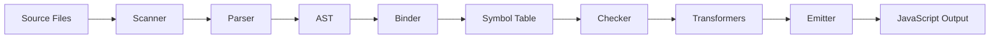

## Introduction

The TypeScript codebase is organized into a modular architecture designed to support both command-line compilation and rich IDE integration. This document provides an overview of the major components and their relationships.

## Directory Structure

The TypeScript source code is organized under `src/` with the following key directories:

### Core Compiler (`src/compiler/`)

<CardGroup cols={2}>
  <Card title="Scanner & Parser" icon="text">
    Lexical analysis and syntax tree construction
  </Card>
  <Card title="Binder" icon="link">
    Symbol creation and scope resolution
  </Card>
  <Card title="Checker" icon="check">
    Type checking and semantic analysis
  </Card>
  <Card title="Emitter" icon="code">
    JavaScript code generation
  </Card>
</CardGroup>

The compiler directory contains 77+ TypeScript files including:
- `scanner.ts` (4,101 lines) - Tokenizes source code
- `parser.ts` (10,823 lines) - Builds Abstract Syntax Trees
- `binder.ts` (3,913 lines) - Creates symbols and control flow
- `checker.ts` (54,434 lines) - The type checker (largest file)
- `emitter.ts` (6,378 lines) - Generates JavaScript output
- `types.ts` - Core type definitions and SyntaxKind enum
- `utilities.ts` - Shared utility functions

### Language Services (`src/services/`)

<Info>
The services layer provides IDE features like autocompletion, navigation, and refactoring.
</Info>

Contains 168+ TypeScript files organized into:

**Core Services:**
- `completions.ts` - Autocompletion engine
- `goToDefinition.ts` - Symbol navigation
- `findAllReferences.ts` - Symbol usage tracking
- `rename.ts` - Symbol renaming
- `documentHighlights.ts` - Occurrence highlighting

**Formatting & Editing:**
- `formatting/` - Code formatting rules
- `codefixes/` - Quick fixes for diagnostics
- `refactors/` - Refactoring operations
- `organizeImports.ts` - Import statement organization

**Analysis Features:**
- `callHierarchy.ts` - Call graph navigation
- `inlayHints.ts` - Inline type hints
- `navigationBar.ts` - File outline view

### Language Server (`src/server/` & `src/tsserver/`)

<Card title="TSServer Protocol" icon="server">
  The language server implements the editor communication protocol defined in `protocol.ts`
</Card>

Provides the server-side implementation for editor integration:
- Request/response handling
- Session management
- Project coordination

### Supporting Modules

| Directory | Purpose |
|-----------|----------|
| `src/typescript/` | Public API exports |
| `src/tsc/` | Command-line compiler |
| `src/typingsInstaller/` | Automatic type acquisition |
| `src/harness/` | Test infrastructure |
| `src/lib/` | Built-in type definitions |

## Component Relationships

<Steps>
  <Step title="Source Input">
    Source files are read and passed to the Scanner
  </Step>
  <Step title="Lexical Analysis">
    Scanner tokenizes the input into a stream of tokens
  </Step>
  <Step title="Syntax Analysis">
    Parser constructs an Abstract Syntax Tree (AST)
  </Step>
  <Step title="Binding">
    Binder creates symbols and resolves scopes
  </Step>
  <Step title="Type Checking">
    Checker performs semantic analysis and type checking
  </Step>
  <Step title="Transformation">
    Transformers convert newer syntax to target version
  </Step>
  <Step title="Emission">
    Emitter generates JavaScript and declaration files
  </Step>
</Steps>

## Compilation Pipeline

The compilation process follows this flow:



<Tip>
The checker (`checker.ts`) is the heart of the compiler, containing the type system implementation and spanning over 54,000 lines of code.
</Tip>

## Language Service Architecture

The language service layer sits on top of the compiler and provides incremental, interactive features:

<CodeGroup>
```typescript Services Layer
// Services use the compiler's Program and TypeChecker
const program = createProgram(files, options);
const checker = program.getTypeChecker();
const sourceFile = program.getSourceFile(fileName);

// Services provide IDE features
const completions = getCompletionsAtPosition(...);
const definitions = getDefinitionAtPosition(...);
const references = findAllReferences(...);
```

```typescript Compiler Core
// Compiler creates immutable structures
const scanner = createScanner(languageVersion, text);
const sourceFile = parseSourceFile(fileName, text);
bindSourceFile(sourceFile, options);
const diagnostics = getSemanticDiagnostics(sourceFile);
```
</CodeGroup>

## Key Design Principles

<AccordionGroup>
  <Accordion title="Immutable Data Structures">
    AST nodes are immutable. Transformations create new nodes rather than modifying existing ones.
  </Accordion>
  
  <Accordion title="Lazy Evaluation">
    Type checking and symbol resolution happen on-demand to support incremental compilation.
  </Accordion>
  
  <Accordion title="Position-Based APIs">
    Language service features work with text positions rather than requiring full AST traversal.
  </Accordion>
  
  <Accordion title="Visitor Pattern">
    The `forEachChild` function enables efficient AST traversal and transformation.
  </Accordion>
</AccordionGroup>

## Program and Type Checker

The `Program` interface (`src/compiler/program.ts`) is the central coordinator:

<CardGroup cols={2}>
  <Card title="Program" icon="folder-tree">
    - Manages source files
    - Coordinates module resolution
    - Provides access to TypeChecker
    - Handles diagnostics collection
  </Card>
  
  <Card title="TypeChecker" icon="magnifying-glass">
    - Performs type inference
    - Resolves symbols
    - Checks type compatibility
    - Reports semantic errors
  </Card>
</CardGroup>

## Transformers

The `src/compiler/transformers/` directory contains transformation pipelines:

- **ES downleveling**: `es2015.ts`, `es2016.ts`, `es2017.ts`, etc.
- **Feature transforms**: `jsx.ts`, `generators.ts`, `decorators.ts`
- **Module transforms**: `module/` directory for various module formats

<Note>
Transformers convert modern TypeScript/JavaScript syntax into code compatible with older runtimes.
</Note>

## Public API Surface

The `src/typescript/` directory defines the public API exported to consumers:

```typescript
// Public API usage
import * as ts from 'typescript';

const program = ts.createProgram(fileNames, options);
const emitResult = program.emit();
const diagnostics = ts.getPreEmitDiagnostics(program);
```

## Development Entry Points

<Steps>
  <Step title="Command-Line Compiler">
    Entry point: `src/tsc/tsc.ts` - Implements the `tsc` command
  </Step>
  
  <Step title="Language Server">
    Entry point: `src/tsserver/tsserver.ts` - Implements editor integration
  </Step>
  
  <Step title="Programmatic API">
    Entry point: `src/typescript/typescript.ts` - Public API exports
  </Step>
</Steps>

## Next Steps

<CardGroup cols={2}>
  <Card title="Compiler Internals" icon="gear" href="/contributing/compiler-internals">
    Deep dive into scanner, parser, binder, checker, and emitter
  </Card>
  
  <Card title="Language Service" icon="wand-magic-sparkles" href="/contributing/language-service-internals">
    How IDE features like completions and navigation work
  </Card>
</CardGroup>

<Warning>
The TypeScript codebase is highly optimized for performance. When contributing, be mindful of allocation patterns and traversal efficiency.
</Warning>