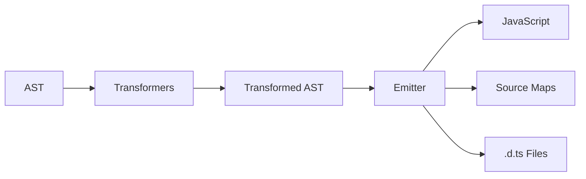

## Overview

The TypeScript compiler transforms TypeScript source code into JavaScript through a multi-phase pipeline. This document explores the internal implementation of each phase.

<Info>
The compiler is designed to be fast, incremental, and support rich IDE integration.
</Info>

## Scanner (Lexical Analysis)

**Location**: `src/compiler/scanner.ts` (4,101 lines)

The scanner converts raw text into a stream of tokens.

### Scanner Interface

```typescript Scanner API
interface Scanner {
  getToken(): SyntaxKind;
  getTokenStart(): number;
  getTokenEnd(): number;
  getTokenText(): string;
  getTokenValue(): string;
  
  scan(): SyntaxKind;
  
  // Context-specific scanning
  scanJsxToken(): JsxTokenSyntaxKind;
  scanJsDocToken(): JSDocSyntaxKind;
  reScanGreaterToken(): SyntaxKind;
  reScanSlashToken(): SyntaxKind;
  reScanTemplateToken(isTaggedTemplate: boolean): SyntaxKind;
}
```

### Key Responsibilities

<CardGroup cols={2}>
  <Card title="Tokenization" icon="scissors">
    Break source text into tokens (keywords, identifiers, operators, literals)
  </Card>
  
  <Card title="Token Classification" icon="tags">
    Identify token types using the SyntaxKind enum
  </Card>
  
  <Card title="Context Awareness" icon="brain">
    Handle JSX, JSDoc, and template strings with specialized scanners
  </Card>
  
  <Card title="Error Recovery" icon="shield">
    Report lexical errors (unterminated strings, invalid characters)
  </Card>
</CardGroup>

### Implementation Details

<CodeGroup>
```typescript Scanner Creation
// From src/compiler/scanner.ts
export function createScanner(
  languageVersion: ScriptTarget,
  skipTrivia: boolean,
  languageVariant?: LanguageVariant,
  textInitial?: string,
  onError?: ErrorCallback,
  start?: number,
  length?: number
): Scanner {
  // Scanner state
  let text = textInitial;
  let pos: number;
  let end: number;
  let token: SyntaxKind;
  let tokenValue: string;
  let tokenFlags: TokenFlags;
  
  // Main scanning loop
  function scan(): SyntaxKind {
    // Skip whitespace and comments
    // Identify next token
    // Return token type
  }
}
```

```typescript Token Types
// From src/compiler/types.ts
export const enum SyntaxKind {
  Unknown,
  EndOfFileToken,
  SingleLineCommentTrivia,
  MultiLineCommentTrivia,
  NewLineTrivia,
  WhitespaceTrivia,
  // Literals
  NumericLiteral,
  BigIntLiteral,
  StringLiteral,
  // Keywords
  BreakKeyword,
  CaseKeyword,
  ClassKeyword,
  // ... 300+ token types
}
```
</CodeGroup>

<Tip>
The scanner uses character codes (`CharacterCodes` enum) for efficient character comparison without string allocation.
</Tip>

## Parser (Syntax Analysis)

**Location**: `src/compiler/parser.ts` (10,823 lines)

The parser constructs an Abstract Syntax Tree (AST) from the token stream.

### Parser Architecture

<Steps>
  <Step title="Token Consumption">
    Uses Scanner to get next token and advance position
  </Step>
  
  <Step title="Grammar Rules">
    Implements TypeScript grammar rules as recursive descent parser
  </Step>
  
  <Step title="AST Construction">
    Creates immutable Node objects using factory functions
  </Step>
  
  <Step title="Error Recovery">
    Attempts to continue parsing after syntax errors
  </Step>
</Steps>

### Key Functions

```typescript Parser Entry Points
// Main parser entry point
export function parseSourceFile(
  fileName: string,
  sourceText: string,
  languageVersion: ScriptTarget,
  syntaxCursor?: IncrementalParser.SyntaxCursor,
  setParentNodes?: boolean,
  scriptKind?: ScriptKind
): SourceFile

// Parse individual constructs
function parseClassDeclaration(): ClassDeclaration
function parseFunctionDeclaration(): FunctionDeclaration
function parseTypeAnnotation(): TypeNode
function parseExpression(): Expression
```

### AST Node Structure

Every AST node extends the base `Node` interface:

<CodeGroup>
```typescript Node Interface
interface Node {
  kind: SyntaxKind;
  pos: number;        // Start position in source
  end: number;        // End position in source
  flags: NodeFlags;
  parent: Node;       // Parent node reference
  // ... additional properties
}
```

```typescript Example Nodes
interface FunctionDeclaration extends Node {
  kind: SyntaxKind.FunctionDeclaration;
  name?: Identifier;
  typeParameters?: NodeArray<TypeParameterDeclaration>;
  parameters: NodeArray<ParameterDeclaration>;
  type?: TypeNode;
  body?: Block;
}

interface BinaryExpression extends Node {
  kind: SyntaxKind.BinaryExpression;
  left: Expression;
  operator: BinaryOperator;
  right: Expression;
}
```
</CodeGroup>

<Note>
The parser creates a complete, position-accurate AST. The `pos` and `end` properties enable precise source mapping.
</Note>

### Incremental Parsing

The parser supports incremental reparsing for editor scenarios:

```typescript
// Reuse unchanged subtrees from previous parse
const syntaxCursor = createSyntaxCursor(oldSourceFile);
const newSourceFile = parseSourceFile(
  fileName,
  newText,
  languageVersion,
  syntaxCursor  // Reuses nodes where possible
);
```

## Binder (Symbol Creation)

**Location**: `src/compiler/binder.ts` (3,913 lines)

The binder creates symbols and establishes scope relationships.

### Binding Process

<AccordionGroup>
  <Accordion title="Symbol Creation">
    Creates `Symbol` objects for declarations (variables, functions, types, etc.)
  </Accordion>
  
  <Accordion title="Scope Management">
    Builds symbol tables for each scope (global, module, function, block)
  </Accordion>
  
  <Accordion title="Flow Analysis">
    Constructs control flow graphs for type narrowing
  </Accordion>
  
  <Accordion title="Container Tracking">
    Identifies function boundaries and other semantic containers
  </Accordion>
</AccordionGroup>

### Symbol Table

```typescript Symbol Structure
interface Symbol {
  flags: SymbolFlags;           // Kind of symbol (variable, function, etc.)
  escapedName: __String;        // Symbol name
  declarations?: Declaration[]; // AST nodes that declare this symbol
  exports?: SymbolTable;        // Exported members (for modules, classes)
  members?: SymbolTable;        // Members (for classes, interfaces)
  // ... additional properties
}

type SymbolTable = Map<__String, Symbol>;
```

<Tip>
The binder runs in a single pass over the AST, visiting each node exactly once.
</Tip>

### Control Flow Analysis

The binder builds control flow graphs to support type narrowing:

<CodeGroup>
```typescript Flow Nodes
interface FlowNode {
  flags: FlowFlags;
}

interface FlowAssignment extends FlowNode {
  node: Expression | VariableDeclaration;
  antecedent: FlowNode;
}

interface FlowCondition extends FlowNode {
  expression: Expression;
  antecedent: FlowNode;
}
```

```typescript Flow Graph Usage
// Type narrowing uses flow analysis
let x: string | number;

if (typeof x === "string") {
  // Checker uses flow graph to narrow type to string
  x.toUpperCase();
}
```
</CodeGroup>

### Binding Entry Point

```typescript
// From src/compiler/binder.ts
export function bindSourceFile(
  file: SourceFile,
  options: CompilerOptions
): void {
  // Initialize binding state
  // Walk AST and bind nodes
  // Create symbols and symbol tables
  // Build control flow graph
}
```

## Checker (Type Checking)

**Location**: `src/compiler/checker.ts` (54,434 lines)

The checker is the largest and most complex component, implementing TypeScript's type system.

<Warning>
The checker is highly optimized but complex. Changes here require careful consideration of performance and correctness.
</Warning>

### Checker Responsibilities

<CardGroup cols={2}>
  <Card title="Type Inference" icon="brain">
    Infer types from context and initialization
  </Card>
  
  <Card title="Type Checking" icon="check-double">
    Verify type compatibility and assignability
  </Card>
  
  <Card title="Symbol Resolution" icon="link">
    Resolve references to their declarations
  </Card>
  
  <Card title="Diagnostics" icon="triangle-exclamation">
    Report type errors and semantic issues
  </Card>
</CardGroup>

### Type Checker Interface

```typescript TypeChecker API
interface TypeChecker {
  getTypeAtLocation(node: Node): Type;
  getSymbolAtLocation(node: Node): Symbol | undefined;
  getTypeOfSymbolAtLocation(symbol: Symbol, node: Node): Type;
  
  // Type operations
  isTypeAssignableTo(source: Type, target: Type): boolean;
  getPropertiesOfType(type: Type): Symbol[];
  getSignaturesOfType(type: Type, kind: SignatureKind): Signature[];
  
  // Diagnostics
  getDiagnostics(sourceFile?: SourceFile): Diagnostic[];
}
```

### Type System

The checker implements a rich type system:

<Tabs>
  <Tab title="Base Types">
    ```typescript
    interface Type {
      flags: TypeFlags;
      symbol?: Symbol;
      // ... type-specific properties
    }
    
    // Primitive types
    - StringType
    - NumberType
    - BooleanType
    - VoidType
    - UndefinedType
    - NullType
    ```
  </Tab>
  
  <Tab title="Complex Types">
    ```typescript
    // Object types
    interface ObjectType extends Type {
      objectFlags: ObjectFlags;
    }
    
    // Union and intersection types
    interface UnionType extends Type {
      types: Type[];
    }
    
    interface IntersectionType extends Type {
      types: Type[];
    }
    ```
  </Tab>
  
  <Tab title="Generic Types">
    ```typescript
    interface TypeReference extends ObjectType {
      target: GenericType;
      typeArguments?: Type[];
    }
    
    interface TypeParameter extends Type {
      constraint?: Type;
      default?: Type;
    }
    ```
  </Tab>
</Tabs>

### Type Checking Algorithm

<Steps>
  <Step title="Symbol Resolution">
    Resolve identifiers to their symbol declarations
  </Step>
  
  <Step title="Type Instantiation">
    Instantiate generic types with type arguments
  </Step>
  
  <Step title="Type Inference">
    Infer type arguments from usage context
  </Step>
  
  <Step title="Assignability Check">
    Check if source type is assignable to target type
  </Step>
  
  <Step title="Error Reporting">
    Generate diagnostic messages for type errors
  </Step>
</Steps>

## Emitter (Code Generation)

**Location**: `src/compiler/emitter.ts` (6,378 lines)

The emitter generates JavaScript code and declaration files from the AST.

### Emission Pipeline



### Emitter Features

<CardGroup cols={2}>
  <Card title="JS Generation" icon="file-code">
    Outputs JavaScript matching target ES version
  </Card>
  
  <Card title="Source Maps" icon="map">
    Generates source maps for debugging
  </Card>
  
  <Card title="Declarations" icon="file-lines">
    Emits `.d.ts` type declaration files
  </Card>
  
  <Card title="Comments" icon="comment">
    Preserves and positions comments
  </Card>
</CardGroup>

### Emitter Interface

```typescript
// From src/compiler/emitter.ts
export function emitFiles(
  resolver: EmitResolver,
  host: EmitHost,
  targetSourceFile?: SourceFile,
  transformers?: EmitTransformers
): EmitResult {
  // Transform AST
  const transformed = transformNodes(...);
  
  // Emit each file
  for (const sourceFile of transformed.files) {
    printFile(sourceFile);
  }
  
  return { diagnostics, emittedFiles };
}
```

### Printer

The printer converts AST nodes to text:

```typescript Printer Usage
const printer = createPrinter({
  newLine: NewLineKind.LineFeed,
  removeComments: false,
});

const result = printer.printFile(sourceFile);
```

<Note>
The emitter uses a `TextWriter` for efficient string building without excessive allocations.
</Note>

## Transformers

**Location**: `src/compiler/transformers/`

Transformers modify the AST before emission:

### Transformation Categories

<Tabs>
  <Tab title="ES Downleveling">
    - `es2015.ts` - Classes, arrow functions, destructuring
    - `es2016.ts` - Exponentiation operator
    - `es2017.ts` - Async/await
    - `es2018.ts` - Object spread, async iteration
    - `es2019.ts` - Optional catch binding
    - `es2020.ts` - Optional chaining, nullish coalescing
    - `es2021.ts` - Logical assignment
    - `esnext.ts` - Latest features
  </Tab>
  
  <Tab title="Feature Transforms">
    - `jsx.ts` - JSX to JavaScript
    - `generators.ts` - Generator functions
    - `esDecorators.ts` - Stage 3 decorators
    - `legacyDecorators.ts` - Experimental decorators
    - `typeSerializer.ts` - Emit decorator metadata
  </Tab>
  
  <Tab title="Module Systems">
    - `module/module.ts` - Module transformation
    - CommonJS conversion
    - ES module interop
    - AMD/UMD/System formats
  </Tab>
</Tabs>

### Transformer Pattern

```typescript Transformer Structure
function transformSourceFile(context: TransformationContext) {
  return (node: SourceFile): SourceFile => {
    function visitor(node: Node): Node {
      // Transform node based on kind
      switch (node.kind) {
        case SyntaxKind.ClassDeclaration:
          return transformClassDeclaration(node);
        // ... other cases
      }
      
      // Recursively visit children
      return visitEachChild(node, visitor, context);
    }
    
    return visitNode(node, visitor);
  };
}
```

## Performance Optimizations

<AccordionGroup>
  <Accordion title="Node Reuse">
    The parser reuses unchanged nodes during incremental parsing
  </Accordion>
  
  <Accordion title="Lazy Checking">
    Type checking happens on-demand, not for all files upfront
  </Accordion>
  
  <Accordion title="Symbol Caching">
    Symbol resolution results are cached to avoid repeated work
  </Accordion>
  
  <Accordion title="String Interning">
    Identifier strings are interned to reduce memory usage
  </Accordion>
</AccordionGroup>

## Next Steps

<Card title="Language Service Internals" icon="wand-magic-sparkles" href="/contributing/language-service-internals">
  Learn how the compiler powers IDE features like autocompletion and navigation
</Card>

## Reference Files

Key implementation files in `src/compiler/`:

- `scanner.ts:42` - `tokenIsIdentifierOrKeyword()` function
- `scanner.ts:389` - `isUnicodeIdentifierStart()` function  
- `scanner.ts:414` - `tokenToString()` function
- `parser.ts` - Main parsing logic
- `binder.ts` - Symbol creation and binding
- `checker.ts` - Type system implementation
- `emitter.ts` - Code generation
- `types.ts` - Core type definitions
- `utilities.ts` - Shared helper functions