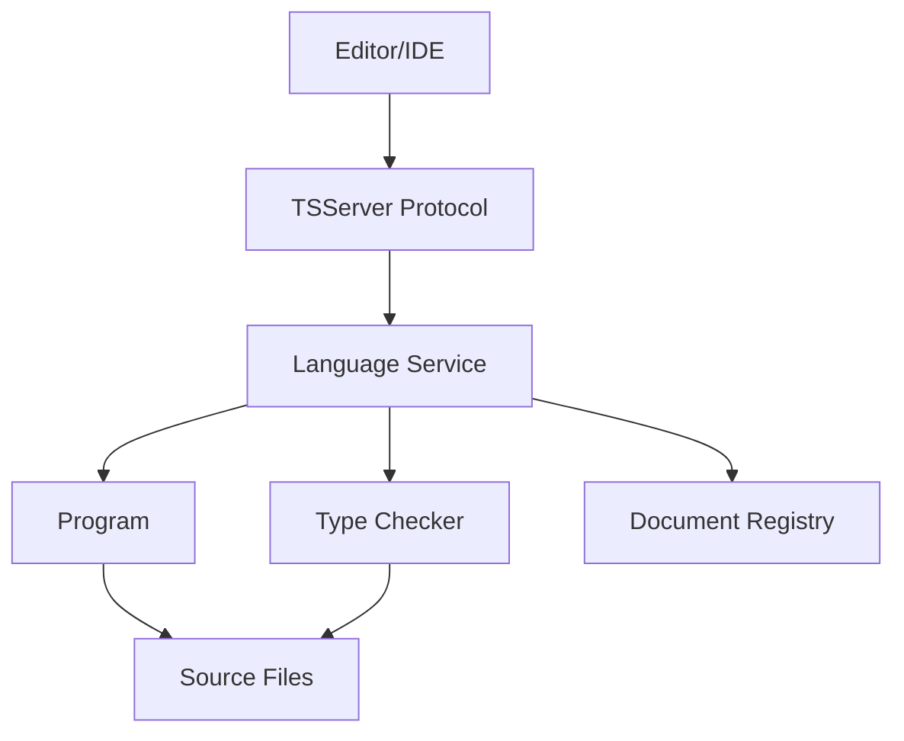

## Overview

The TypeScript Language Service provides rich IDE features like autocompletion, navigation, refactoring, and diagnostics. It's built on top of the compiler but designed for interactive, incremental operation.

<Info>
The language service powers editors like VS Code, Visual Studio, Sublime Text, and many others through the Language Server Protocol.
</Info>

## Architecture

**Location**: `src/services/` (168+ TypeScript files)

The language service layer sits between editors and the TypeScript compiler:



### Core Components

<CardGroup cols={2}>
  <Card title="Language Service" icon="gear">
    Main service interface providing IDE features
  </Card>
  
  <Card title="Document Registry" icon="database">
    Caches parsed files and manages versions
  </Card>
  
  <Card title="TSServer" icon="server">
    Server process handling editor requests
  </Card>
  
  <Card title="Protocol" icon="network-wired">
    JSON-based communication protocol
  </Card>
</CardGroup>

## Language Service Interface

**Location**: `src/services/services.ts`

The main service interface exposes IDE features:

<CodeGroup>
```typescript Core Features
interface LanguageService {
  // Completions
  getCompletionsAtPosition(
    fileName: string,
    position: number,
    options?: GetCompletionsAtPositionOptions
  ): CompletionInfo | undefined;
  
  getCompletionEntryDetails(
    fileName: string,
    position: number,
    name: string
  ): CompletionEntryDetails | undefined;
  
  // Navigation
  getDefinitionAtPosition(
    fileName: string,
    position: number
  ): DefinitionInfo[] | undefined;
  
  getDefinitionAndBoundSpan(
    fileName: string,
    position: number
  ): DefinitionInfoAndBoundSpan | undefined;
  
  findReferences(
    fileName: string,
    position: number
  ): ReferencedSymbol[] | undefined;
}
```

```typescript Refactoring & Edits
interface LanguageService {
  // Refactoring
  getApplicableRefactors(
    fileName: string,
    positionOrRange: number | TextRange,
    preferences: UserPreferences
  ): ApplicableRefactorInfo[];
  
  getEditsForRefactor(
    fileName: string,
    formatOptions: FormatCodeSettings,
    positionOrRange: number | TextRange,
    refactorName: string,
    actionName: string
  ): RefactorEditInfo | undefined;
  
  // Quick fixes
  getCodeFixesAtPosition(
    fileName: string,
    start: number,
    end: number,
    errorCodes: number[]
  ): CodeFixAction[];
}
```

```typescript Analysis
interface LanguageService {
  // Diagnostics
  getSyntacticDiagnostics(fileName: string): Diagnostic[];
  getSemanticDiagnostics(fileName: string): Diagnostic[];
  getSuggestionDiagnostics(fileName: string): Diagnostic[];
  
  // Type information
  getQuickInfoAtPosition(
    fileName: string,
    position: number
  ): QuickInfo | undefined;
  
  // Highlighting
  getDocumentHighlights(
    fileName: string,
    position: number,
    filesToSearch: string[]
  ): DocumentHighlights[] | undefined;
}
```
</CodeGroup>

## Key Features Implementation

### Completions

**Location**: `src/services/completions.ts`

The completion engine provides intelligent suggestions:

<Steps>
  <Step title="Context Analysis">
    Determine completion location (member access, import, type position)
  </Step>
  
  <Step title="Symbol Collection">
    Gather available symbols from scope, type checker, and imports
  </Step>
  
  <Step title="Filtering">
    Filter symbols by prefix and context appropriateness
  </Step>
  
  <Step title="Ranking">
    Sort by relevance using various heuristics
  </Step>
  
  <Step title="Details Generation">
    Provide type info, documentation, and auto-import suggestions
  </Step>
</Steps>

<Tabs>
  <Tab title="Member Completions">
    ```typescript
    const obj = { foo: 1, bar: "hello" };
    obj.| // Completions: foo, bar
    
    // Implementation:
    // 1. Get type of 'obj'
    // 2. Get properties from type
    // 3. Filter by accessibility
    // 4. Return completion entries
    ```
  </Tab>
  
  <Tab title="Import Completions">
    ```typescript
    import { | } from "module";
    //       ^ Completions: exported symbols
    
    // Implementation:
    // 1. Resolve module specifier
    // 2. Get module's exports
    // 3. Return exportable symbols
    ```
  </Tab>
  
  <Tab title="Auto-Import">
    ```typescript
    path.| // Suggests 'join' with auto-import
    
    // Generates:
    import { join } from "path";
    
    // Implementation:
    // 1. Search workspace for symbols
    // 2. Check if accessible via import
    // 3. Generate import statement
    ```
  </Tab>
</Tabs>

<Tip>
Completions are position-based and incremental - they don't require full type checking of the entire program.
</Tip>

### Go to Definition

**Location**: `src/services/goToDefinition.ts`

Navigates from usage to declaration:

```typescript Definition Resolution
// User clicks on 'foo' in:
const x = foo;

// Implementation flow:
// 1. Get symbol at position
const symbol = checker.getSymbolAtLocation(node);

// 2. Get symbol's declarations
const declarations = symbol?.declarations;

// 3. Return declaration locations
return declarations?.map(decl => ({
  fileName: decl.getSourceFile().fileName,
  textSpan: createTextSpanFromNode(decl),
}));
```

<AccordionGroup>
  <Accordion title="Local Declarations">
    For local variables, functions, and classes - finds the declaration in the same file
  </Accordion>
  
  <Accordion title="Imported Symbols">
    Follows imports to the original declaration in another file or module
  </Accordion>
  
  <Accordion title="Type Declarations">
    For library types, navigates to `.d.ts` declaration files
  </Accordion>
  
  <Accordion title="Multiple Definitions">
    Handles function overloads, merged declarations, and augmentations
  </Accordion>
</AccordionGroup>

### Find All References

**Location**: `src/services/findAllReferences.ts`

Finds all usages of a symbol across the project:

<Steps>
  <Step title="Symbol Identification">
    Get the symbol at the current position
  </Step>
  
  <Step title="Related Symbols">
    Find related symbols (implementations, overrides, aliases)
  </Step>
  
  <Step title="File Search">
    Search source files for references
  </Step>
  
  <Step title="Context Classification">
    Classify references (read, write, declaration)
  </Step>
  
  <Step title="Results Grouping">
    Group results by file and context
  </Step>
</Steps>

<CodeGroup>
```typescript Reference Types
// Different reference contexts:

function foo() {}  // Declaration
foo();             // Read reference

let bar = 1;       // Declaration  
bar = 2;           // Write reference
bar++;             // Read+Write reference

export { foo };    // Export reference
```

```typescript Finding References
// Implementation uses:
- Symbol resolution
- Lexical search (fast pre-filter)
- Semantic validation
- Import/export tracking
```
</CodeGroup>

### Rename

**Location**: `src/services/rename.ts`

Renames symbols across all files while preserving semantics:

<Warning>
Rename is complex - it must handle scope conflicts, imports/exports, and string literal references.
</Warning>

```typescript Rename Process
// Renaming 'foo' to 'bar':

// 1. Check if rename is valid
if (newName is invalid or conflicts with scope) {
  return error;
}

// 2. Find all references
const references = findAllReferences(symbol);

// 3. Generate text changes for each file
const edits = references.map(ref => ({
  fileName: ref.fileName,
  textChanges: [{
    span: ref.textSpan,
    newText: newName
  }]
}));

// 4. Update imports/exports
if (symbol is exported) {
  updateImportStatements(edits);
}
```

### Code Fixes

**Location**: `src/services/codefixes/`

Provides quick fixes for diagnostics:

<CardGroup cols={2}>
  <Card title="Import Fixes" icon="file-import">
    Add missing imports automatically
  </Card>
  
  <Card title="Type Fixes" icon="code">
    Add missing type annotations
  </Card>
  
  <Card title="Declaration Fixes" icon="plus">
    Declare missing variables or properties
  </Card>
  
  <Card title="Spelling Fixes" icon="spell-check">
    Suggest corrections for typos
  </Card>
</CardGroup>

Each fix is implemented as a separate module:

```bash
src/services/codefixes/
├── fixAddMissingAwait.ts
├── fixAddMissingMember.ts  
├── fixClassIncorrectlyImplementsInterface.ts
├── fixImport.ts
├── fixMissingTypeAnnotationOnExports.ts
├── fixSpelling.ts
└── ... (50+ code fix providers)
```

### Refactorings

**Location**: `src/services/refactors/`

Provides structural code transformations:

<Tabs>
  <Tab title="Extract">
    ```typescript
    // Extract to function
    const x = a + b;
    const y = x * 2;
    
    // Becomes:
    function newFunction(a: number, b: number) {
      const x = a + b;
      return x * 2;
    }
    const y = newFunction(a, b);
    ```
  </Tab>
  
  <Tab title="Convert">
    ```typescript
    // Convert to arrow function
    function foo(x: number) {
      return x * 2;
    }
    
    // Becomes:
    const foo = (x: number) => x * 2;
    ```
  </Tab>
  
  <Tab title="Move">
    ```typescript
    // Move to new file
    // Handles:
    // - Creating new file
    // - Moving symbol
    // - Updating imports
    // - Fixing references
    ```
  </Tab>
</Tabs>

Refactoring modules:

```bash
src/services/refactors/
├── convertToEsModule.ts
├── extractFunction.ts
├── extractSymbol.ts
├── extractType.ts
├── generateGetAccessorAndSetAccessor.ts
├── inferFunctionReturnType.ts
├── moveToFile.ts
└── ... (20+ refactoring providers)
```

## Document Registry

**Location**: `src/services/documentRegistry.ts`

Manages source file caching and versioning:

<CodeGroup>
```typescript Registry Interface
interface DocumentRegistry {
  acquireDocument(
    fileName: string,
    compilationSettings: CompilerOptions,
    scriptSnapshot: IScriptSnapshot,
    version: string
  ): SourceFile;
  
  updateDocument(
    fileName: string,
    compilationSettings: CompilerOptions,
    scriptSnapshot: IScriptSnapshot,
    version: string
  ): SourceFile;
  
  releaseDocument(
    fileName: string,
    compilationSettings: CompilerOptions
  ): void;
}
```

```typescript Incremental Updates
// When file changes:
// 1. Get new text snapshot
const snapshot = ScriptSnapshot.fromString(newText);

// 2. Update document (reuses unchanged nodes)
const newSourceFile = registry.updateDocument(
  fileName,
  options,
  snapshot,
  newVersion
);

// 3. Program can reuse unchanged files
```
</CodeGroup>

<Note>
The registry enables incremental compilation by caching and reusing source files across program instances.
</Note>

## TSServer Protocol

**Location**: `src/server/protocol.ts`

Defines the JSON-based communication protocol:

### Request/Response Model

<CodeGroup>
```json Request Format
{
  "seq": 1,
  "type": "request",
  "command": "completions",
  "arguments": {
    "file": "/path/to/file.ts",
    "line": 10,
    "offset": 15
  }
}
```

```json Response Format  
{
  "seq": 1,
  "type": "response",
  "command": "completions",
  "request_seq": 1,
  "success": true,
  "body": {
    "entries": [
      {
        "name": "foo",
        "kind": "function",
        "sortText": "0"
      }
    ]
  }
}
```

```json Event Format
{
  "seq": 0,
  "type": "event",
  "event": "projectLoadingFinish",
  "body": {
    "projectName": "/path/to/tsconfig.json"
  }
}
```
</CodeGroup>

### Command Types

TSServer supports 100+ commands:

<Tabs>
  <Tab title="File Operations">
    - `open` - Open file for editing
    - `close` - Close file
    - `change` - Update file content
    - `reload` - Reload file from disk
  </Tab>
  
  <Tab title="Navigation">
    - `definition` - Go to definition
    - `implementation` - Find implementations
    - `references` - Find all references
    - `navtree` - Get navigation tree
    - `navbar` - Get navigation bar
  </Tab>
  
  <Tab title="Editing">
    - `completions` - Get completions
    - `quickinfo` - Get hover information
    - `signatureHelp` - Get signature help
    - `codefix` - Get quick fixes
    - `refactor` - Get refactorings
  </Tab>
  
  <Tab title="Diagnostics">
    - `geterr` - Get diagnostics (async)
    - `semanticDiagnosticsSync` - Get semantic diagnostics
    - `syntacticDiagnosticsSync` - Get syntactic diagnostics
  </Tab>
</Tabs>

## Performance Optimizations

<AccordionGroup>
  <Accordion title="Program Reuse">
    The language service reuses Program instances across edits when possible
  </Accordion>
  
  <Accordion title="Incremental Parsing">
    Only modified files are reparsed; unchanged subtrees are reused
  </Accordion>
  
  <Accordion title="Lazy Type Checking">
    Type checking happens on-demand for visible files only
  </Accordion>
  
  <Accordion title="Cancellation">
    Long operations can be cancelled when new edits arrive
  </Accordion>
  
  <Accordion title="Background Analysis">
    Diagnostics are computed in background (async `geterr` command)
  </Accordion>
</AccordionGroup>

### Cancellation Tokens

```typescript Cancellable Operations
interface CancellationToken {
  isCancellationRequested(): boolean;
  throwIfCancellationRequested(): void;
}

// Used throughout services:
function getCompletions(
  fileName: string,
  position: number,
  cancellationToken?: CancellationToken
): CompletionInfo {
  // Check cancellation periodically
  cancellationToken?.throwIfCancellationRequested();
  
  // Expensive operation
  const symbols = getSymbols();
  
  cancellationToken?.throwIfCancellationRequested();
  
  return processSymbols(symbols);
}
```

## Additional Features

### Formatting

**Location**: `src/services/formatting/`

Provides code formatting based on rules:

<CardGroup cols={2}>
  <Card title="Format Document" icon="align-left">
    Format entire file
  </Card>
  
  <Card title="Format Selection" icon="crop">
    Format selected range
  </Card>
  
  <Card title="Format On Type" icon="keyboard">
    Format as user types
  </Card>
  
  <Card title="Format On Paste" icon="paste">
    Format pasted content
  </Card>
</CardGroup>

### Organize Imports

**Location**: `src/services/organizeImports.ts`

Sorts and removes unused imports:

```typescript
// Before:
import { z, a, m } from "module";
import { unused } from "other";

// After organize imports:
import { a, m, z } from "module";
// 'unused' import removed if not referenced
```

### Call Hierarchy

**Location**: `src/services/callHierarchy.ts`

Provides call graph navigation:

```typescript
// Find all callers of a function
function foo() { ... }

// Incoming calls: who calls foo?
bar() -> foo();
baz() -> foo();

// Outgoing calls: what does foo call?
foo() -> helper();
foo() -> util();
```

### Inlay Hints

**Location**: `src/services/inlayHints.ts`

Provides inline hints in editor:

```typescript
// Shows inferred types and parameter names:
const x = getValue();  // : string

function foo(a, b) { ... }
foo(1, 2);  // a: ‸1, b: ‸2
```

## Editor Integration

Editors integrate via different approaches:

<Tabs>
  <Tab title="TSServer (Most Common)">
    ```bash
    # Editor spawns TSServer process
    node tsserver.js --stdio
    
    # Communicates via JSON-RPC over stdio
    Editor <-> TSServer <-> Language Service
    ```
  </Tab>
  
  <Tab title="Direct API">
    ```typescript
    // In-process usage (e.g., webpack)
    import * as ts from "typescript";
    
    const service = ts.createLanguageService(
      host,
      registry
    );
    
    const completions = service.getCompletionsAtPosition(...);
    ```
  </Tab>
  
  <Tab title="Language Server Protocol">
    ```bash
    # Some editors use LSP wrapper
    Editor <-> LSP Client <-> TSServer Adapter <-> TSServer
    ```
  </Tab>
</Tabs>

## Testing

**Location**: `src/harness/`

The language service has extensive tests:

```typescript
// Example test structure
describe("completions", () => {
  it("provides member completions", () => {
    const code = `
      const obj = { foo: 1 };
      obj./**/
    `;
    
    const completions = getCompletionsAtMarker();
    
    assert.contains(completions, "foo");
  });
});
```

## Debugging Tips

<Steps>
  <Step title="Enable Logging">
    Set `TSS_LOG` environment variable to log TSServer requests/responses
  </Step>
  
  <Step title="Inspect Protocol">
    Use `--logVerbosity verbose` to see detailed protocol messages
  </Step>
  
  <Step title="Profile Performance">
    Use `--enableTracing` to generate performance traces
  </Step>
  
  <Step title="Debug TSServer">
    Attach debugger to TSServer process for breakpoints
  </Step>
</Steps>

<CodeGroup>
```bash Enable Logging
export TSS_LOG="-level verbose -file /tmp/tsserver.log"

# TSServer will write detailed logs
```

```bash Tracing
tsc --generateTrace trace_output/

# Generates Chrome-compatible trace files
```
</CodeGroup>

## Contributing to Language Service

<Warning>
Language service changes must be fast and not block the editor UI.
</Warning>

### Best Practices

<AccordionGroup>
  <Accordion title="Use Cancellation Tokens">
    Accept and check `CancellationToken` in long operations
  </Accordion>
  
  <Accordion title="Avoid Full Program Traversal">
    Use position-based APIs and early exits
  </Accordion>
  
  <Accordion title="Cache Aggressively">
    Cache expensive computations with proper invalidation
  </Accordion>
  
  <Accordion title="Test Incrementality">
    Verify features work correctly with incremental updates
  </Accordion>
</AccordionGroup>

## Next Steps

<CardGroup cols={2}>
  <Card title="Architecture Overview" icon="sitemap" href="/contributing/architecture-overview">
    Review the overall TypeScript architecture
  </Card>
  
  <Card title="Compiler Internals" icon="microchip" href="/contributing/compiler-internals">
    Deep dive into compiler implementation
  </Card>
</CardGroup>

## Reference Files

Key language service files in `src/services/`:

- `services.ts` - Main LanguageService interface
- `completions.ts` - Completion engine
- `goToDefinition.ts` - Definition navigation  
- `findAllReferences.ts` - Reference finding
- `rename.ts` - Symbol renaming
- `documentRegistry.ts` - File caching
- `codefixes/` - Quick fix providers
- `refactors/` - Refactoring providers
- `formatting/` - Code formatting

<Tip>
The language service is designed to be responsive and incremental - study how it avoids blocking operations.
</Tip>